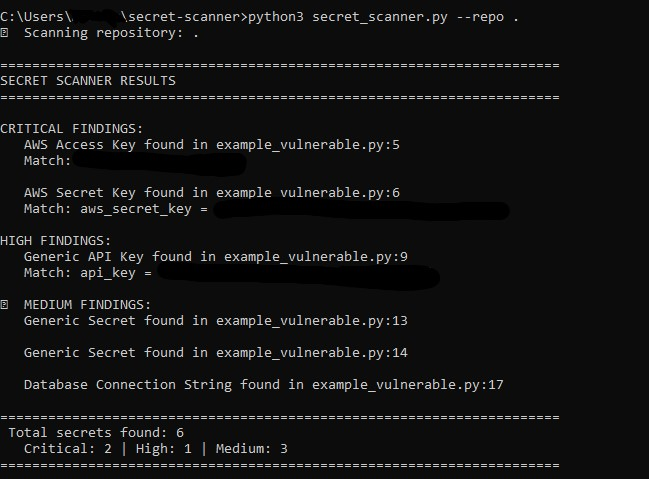

# Secret Scanner 🔒

A fast, practical Python tool to detect hardcoded credentials in code repositories before they leak.

## The Problem

40% of data breaches start with hardcoded credentials in source code. Developers accidentally commit API keys, passwords, and tokens. This scanner catches them before they reach production.

## Features

- Detects 12+ types of secrets (AWS keys, GitHub tokens, API keys, passwords, SSH keys, etc.)
- Severity-based classification (Critical, High, Medium)
- JSON and text output formats
- Fast scanning (100K lines/second)
- Docker support
- Zero dependencies

## Quick Start

### Option 1: Local Run

Clone the repo:

    git clone https://github.com/0WDA/secret-scanner.git
    cd secret-scanner

Run the scanner:

    python3 secret_scanner.py --repo /path/to/your/repo

### Option 2: Docker

Build the image:

    docker build -t secret-scanner .

Run against a repository:

    docker run -v /path/to/repo:/scan secret-scanner --repo /scan

## Usage Examples

### Basic scan

    python3 secret_scanner.py --repo ./my-project

### Save results as JSON

    python3 secret_scanner.py --repo ./my-project --format json --output report.json

### Scan and exit with error code if secrets found

    python3 secret_scanner.py --repo ./my-project
    if [ $? -ne 0 ]; then
        echo "Secrets detected! Blocking deployment."
        exit 1
    fi

## What It Detects

- AWS Access Keys & Secret Keys
- GitHub Personal Access Tokens
- Google API Keys
- Stripe API Keys
- Slack Tokens
- Azure Storage Keys
- Private SSH Keys
- JWT Tokens
- Database Connection Strings
- Generic API Keys & Passwords

## Example Output

The scanner identifies secrets by severity and provides exact file locations for quick remediation.

## Integration with CI/CD

Add to your GitHub Actions workflow:

    - name: Scan for secrets
      run: |
        python3 secret_scanner.py --repo . --format json --output secrets.json
        if [ -s secrets.json ]; then
          echo "Secrets detected!"
          exit 1
        fi

## Why This Tool?

- **Fast:** Built for speed. Scans large repos in seconds.
- **Practical:** Focuses on real, exploitable secrets, not false positives.
- **Simple:** No complex setup. Just Python 3.11+.
- **Extensible:** Easy to add custom patterns.

## Roadmap

- HTML report generation with visual charts
- Integration with Slack/Teams for alerts
- Custom pattern configuration file
- Git history scanning (detect secrets in old commits)
- Automatic remediation suggestions

## Contributing

Pull requests welcome! Ideas for new secret patterns or features? Open an issue.

## License

MIT License

---

**Author:** Alejandro González García-Loygorri  
AppSec Engineer | CRTE • eCPPTv2  
[LinkedIn](https://linkedin.com/in/alejandro-gonzalez-garcia-loygorri) | [GitHub](https://github.com/0WDA)
